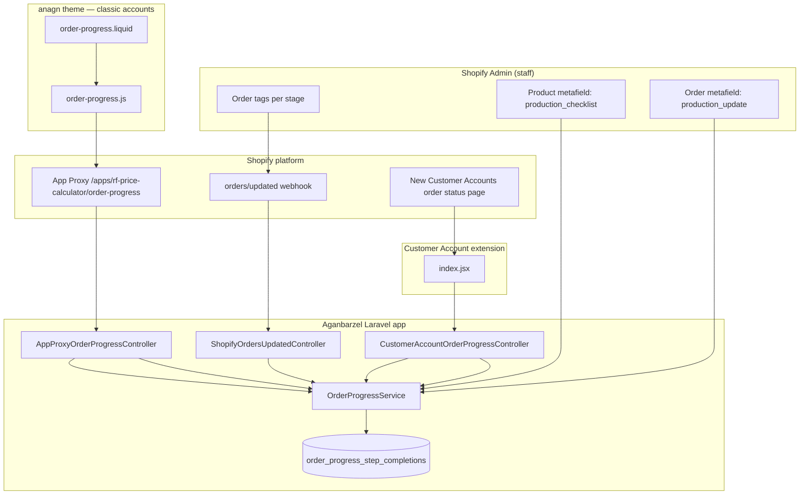

# Order Progress — Full Development Guide

This document describes **everything built** for the **order production checklist / order status** feature across two codebases:

| Project | Path | Role |
|---------|------|------|
| **Laravel Shopify app** | `C:\Users\adx\Documents\GitHub\Aganbarzel` | API, webhooks, business logic, Customer Account UI extension |
| **Shopify theme (Anagn)** | `C:\Users\adx\Desktop\anagn theme file` | Classic customer account order page (App Proxy UI) |

The same Shopify app handles this feature and the **RF price calculator** (`rf-price-calculator`). They share the app proxy prefix and Partner app credentials but are separate features in code.

---

## Table of contents

1. [What the client asked for](#1-what-the-client-asked-for)
2. [High-level architecture](#2-high-level-architecture)
3. [How progress is calculated](#3-how-progress-is-calculated)
4. [Laravel backend (Aganbarzel)](#4-laravel-backend-aganbarzel)
5. [Customer Account extension](#5-customer-account-extension)
6. [Classic storefront theme](#6-classic-storefront-theme)
7. [Webhooks](#7-webhooks)
8. [Shopify Admin setup (metafields & tags)](#8-shopify-admin-setup-metafields--tags)
9. [Configuration reference](#9-configuration-reference)
10. [Deployment & environments](#10-deployment--environments)
11. [File inventory](#11-file-inventory)
12. [Testing checklist](#12-testing-checklist)
13. [Related docs](#13-related-docs)

---

## 1. What the client asked for

Three improvements (see also `docs/ORDER_PROGRESS_CLIENT_REQUIREMENTS.md`):

| # | Feature | What customers see | How we built it |
|---|---------|-------------------|-----------------|
| **1** | **Completion date per step** | Date/time when each production step was done | Webhook saves first-seen timestamp per step in DB; API merges into `steps[].completed_at` |
| **2** | **First step auto-complete** | First checklist row always “done” with order date; no staff tag for “order created” | `auto_complete_first_step` in config; uses Shopify `order.created_at` |
| **3** | **Split notes** | Per-step **estimates** (product) vs one **order-level delay** message (order) | Product metafield `estimate_note` → `estimate_display`; order metafield `production_update` → `production_update_note` |

**Delivery order used in planning:** (2) auto-first step → (3) split notes → (1) dates for other steps via webhooks.

---

## 2. High-level architecture



**Two customer-facing surfaces:**

| Surface | Who uses it | How it loads data |
|---------|-------------|-------------------|
| **Classic theme** | Logged-in customers on legacy `/account/orders/:id` | Theme JS → App Proxy → `GET /proxy/order-progress` |
| **Customer Account extension** | Logged-in customers on **new** Customer Accounts order status | React extension → `GET /api/customer-account/order-progress` + session JWT |

Both endpoints call the same **`OrderProgressService::build()`** so behavior stays aligned.

---

## 3. How progress is calculated

### 3.1 Checklist source (which steps exist)

1. Read line items on the order → unique **product IDs**.
2. For each product, load metafield **`custom.production_checklist`** (JSON array).
3. **Merge** rows by `key` (first product wins duplicate keys), sort by `position`.
4. If no product metafield data and `fallback_steps_when_no_metafield` is true → use global steps from **`config/order-progress.php`**.

Each step row needs at least: `key`, `label` or `label_he`, `tag`. Optional: `eta_days`, `estimate_note`, `note` (legacy), `position`, `auto_from_order`.

### 3.2 Is a step “done”?

| Step type | Rule |
|-----------|------|
| **Auto-first step** | Always `done` if `auto_complete_first_step` is enabled (first row by `position`, or row with `auto_from_order: true` in `flag` mode). |
| **All other steps** | `done` when the order’s **tags** contain that step’s `tag` (case-insensitive). |

Tags come from Shopify order data (REST/Admin API on read; webhook payload on write).

### 3.3 Completion dates (`completed_at`)

| Step type | Source of `completed_at` |
|-----------|-------------------------|
| **Auto-first** | Order **`created_at`** (normalized to ISO 8601). |
| **Other steps (done)** | **`order_progress_step_completions`** table (first time tag was seen via webhook). If missing, column may be empty until webhook runs. |

**Policy:** first-write-wins — removing and re-adding a tag does **not** change the stored date.

### 3.4 Notes / estimates (split)

| Field in API | Meaning | Source |
|--------------|---------|--------|
| `steps[].estimate_display` | Per-step standard timing text + optional ETA line | Product checklist `estimate_note` (or legacy `note`) + `eta_days` while step not done |
| `production_update_note` | One order-level manual delay / update | Order metafield **`custom.production_update`** |

### 3.5 Extra customer messaging

- **Payment blocked:** if `financial_status` is in `payment_blocking_financial_statuses` → show `payment_message_he`, ETA sum excludes blocked state logic.
- **Pickup vs delivery:** tags `fulfillment-pickup` / `fulfillment-delivery` → branch + `fulfillment_message_he` when all steps done.
- **Cancelled:** `cancelled_at` set → cancelled banner.
- **Step state:** first incomplete step = `in_progress`, rest incomplete = `pending`, completed = `done`.

---

## 4. Laravel backend (Aganbarzel)

### 4.1 Core service

**File:** `app/Services/OrderProgressService.php`

Main public methods:

| Method | Used by |
|--------|---------|
| `build($shop, $orderId, $customerId)` | Both storefront APIs — returns full JSON payload |
| `recordStepCompletionsFromWebhook($shop, $orderPayload)` | Webhook only — writes DB rows |
| `mergedChecklistTemplatesForOrder($shop, $order)` | Webhook + internal build |

Private helpers include: `buildStepsFromTemplate`, `mergeCompletionDatesFromDatabase`, `fetchOrderProductionUpdateNote`, `resolveAutoFirstStepKey`, `composeEstimateDisplay`, product metafield fetch, tag normalization.

### 4.2 Database

**Migration:** `database/migrations/2026_05_01_120000_create_order_progress_step_completions_table.php`

**Table:** `order_progress_step_completions`

| Column | Purpose |
|--------|---------|
| `user_id` | Shop (Laravel `users` = Shopify shop domain) |
| `shopify_order_id` | Numeric Shopify order ID |
| `step_key` | Checklist row `key` |
| `completed_at` | UTC timestamp (first seen) |

**Model:** `app/Models/OrderProgressStepCompletion.php`

### 4.3 HTTP controllers

| Controller | Route | Auth |
|------------|-------|------|
| `App\Http\Controllers\Storefront\CustomerAccountOrderProgressController` | `GET /api/customer-account/order-progress` | Bearer **Customer Account session token** (`ShopifySessionToken`) |
| `App\Http\Controllers\Storefront\AppProxyOrderProgressController` | `GET /proxy/order-progress` | **App Proxy HMAC** (`ShopifyAppProxy`) + `logged_in_customer_id` |
| `App\Http\Controllers\Webhooks\ShopifyOrdersUpdatedController` | `POST /webhooks/shopify/orders-updated` | **Webhook HMAC** (`ShopifyWebhookVerifier`) |

**Routes:**

- `routes/api.php` — customer account endpoint (throttle 60/min).
- `routes/web.php` — proxy + webhook.

**CSRF:** `app/Http/Middleware/VerifyCsrfToken.php` excludes `webhooks/shopify/orders-updated`.

### 4.4 Support classes

| Class | Role |
|-------|------|
| `app/Support/ShopifySessionToken.php` | Verify JWT from Customer Accounts (`aud` = API key, `sub` = customer GID) |
| `app/Support/ShopifyAppProxy.php` | Verify proxy query signature + timestamp skew |
| `app/Support/ShopifyWebhookVerifier.php` | `X-Shopify-Hmac-Sha256` vs raw body + `SHOPIFY_API_SECRET` |

### 4.5 API JSON response (shared shape)

Both `build()` consumers receive JSON including:

```json
{
  "order_name": "#1234",
  "financial_status": "paid",
  "fulfillment_status": null,
  "cancelled_at": null,
  "branch": "pickup|delivery|unknown",
  "is_payment_blocked": false,
  "payment_message_he": "...",
  "steps": [
    {
      "key": "suppliers_ordered",
      "label_he": "...",
      "tag": "stage-suppliers-ordered",
      "done": true,
      "step_state": "done|in_progress|pending",
      "completed_at": "2026-05-01T12:00:00+00:00",
      "estimate_display": "...",
      "eta_days": 3
    }
  ],
  "eta_summary_he": "...",
  "fulfillment_message_he": "...",
  "order_tags": ["..."],
  "checklist_source": "product_metafield|config_fallback|config|empty",
  "production_update_note": "Optional manual delay text",
  "updated_at": "..."
}
```

### 4.6 Config

**File:** `config/order-progress.php`

- Default Hebrew production steps and tags (fallback).
- Payment blocking statuses and Hebrew messages.
- Pickup/delivery tags and fulfillment messages.
- Product checklist metafield: `custom` / `production_checklist`.
- Order production update: `custom` / `production_update`.
- `auto_complete_first_step`, `auto_complete_first_step_mode` (`position` | `flag`).

**Shopify app config:** `config/shopify-app.php` — optional `SHOPIFY_CUSTOMER_ACCOUNT_SHOP_DOMAIN` when JWT shop host does not match `users.name`.

### 4.7 Shopify app manifest

**File:** `shopify.app.toml` (repo root)

- App name: **`rf-price-calculator`** (must match theme app proxy subpath).
- Webhook: `orders/updated` → `/webhooks/shopify/orders-updated`.
- Scopes include `read_products`, `read_orders`, `write_orders`, etc.
- **`application_url`** — set to the environment you deploy (staging vs live) before `shopify app deploy`.

---

## 5. Customer Account extension

### 5.1 What it is

A **Shopify UI extension** that renders a block on the **new Customer Accounts** order status page (`customer-account.order-status.block.render`).

### 5.2 Project layout

```
extensions/customer-account-order-progress/
├── shopify.extension.toml    # Extension manifest
├── package.json
├── src/index.jsx             # Source (edit this)
├── dist/                     # Built bundle (deploy artifact)
└── README.md
```

### 5.3 How it works

1. Extension loads on order status page via `useOrder()` for context.
2. Gets **session token** from Shopify: `api.sessionToken.get()`.
3. Calls Laravel:
   - `GET {API_BASE_URL}/api/customer-account/order-progress?order_id={id}`
   - Header: `Authorization: Bearer {token}`
4. Renders Hebrew UI: status banner, production update callout, checklist grid (label, status, completed date, estimate), ETA summary, order tags.

### 5.4 Important: API base URL

In **`extensions/customer-account-order-progress/src/index.jsx`**:

```javascript
const API_BASE_URL = "https://staging.aganbarzel.co.il";
```

**Before production release**, change this to the **live** Laravel URL (e.g. `https://aganbarzel.co.il`), then rebuild and deploy:

```bash
cd extensions/customer-account-order-progress
npm install
shopify app build
shopify app deploy
```

### 5.5 Capabilities

From `shopify.extension.toml`:

- `api_access = true`
- `network_access = true` (required to call your Laravel server)

### 5.6 Editor vs live

In the **theme/customer account editor**, the extension shows a static preview banner. Live data only loads for real logged-in customers on a real order.

---

## 6. Classic storefront theme

**Project:** `C:\Users\adx\Desktop\anagn theme file`

Used when the store still uses **legacy Liquid customer accounts** (not only new Customer Accounts).

### 6.1 Files

| File | Purpose |
|------|---------|
| `templates/customers/order.liquid` | Order detail page — includes `` above line items |
| `snippets/order-progress.liquid` | Mount `#order-progress-root`, `data-order-id`, `data-proxy-base` |
| `assets/order-progress.js` | Fetches JSON via App Proxy, renders table + messages |
| `assets/order-progress.css` | Styles (loaded dynamically by JS) |

**Backup copy in Laravel repo:** `theme-assets-anagn/order-progress.css` (keep in sync when changing styles).

### 6.2 App Proxy URL (theme side)

Snippet sets:

```liquid
data-proxy-base="{{ shop.url }}/apps/rf-price-calculator/order-progress"
```

Browser requests:

```
GET https://{shop}.myshopify.com/apps/rf-price-calculator/order-progress?order_id={id}
```

Shopify forwards to Laravel (Partner Dashboard configuration):

```
GET https://{LARAVEL_APP_URL}/proxy/order-progress?...&signature=...&logged_in_customer_id=...
```

**Subpath `rf-price-calculator` must match:**

- `shopify.app.toml` → `name = "rf-price-calculator"`
- Partner Dashboard → App proxy prefix
- Theme snippet variable `order_progress_apps_subpath`

### 6.3 Theme JS behavior

- Only runs if `#order-progress-root` exists (logged-in customer on order page).
- `fetch` with `credentials: 'same-origin'` so Shopify adds proxy auth params.
- Renders: cancelled/payment/fulfillment messages, `production_update_note` box, checklist table with `estimate_display` and `completed_at`, `order_tags`.
- Loads CSS by replacing `.js` with `.css` in the script URL.

### 6.4 Customer journey (classic)

1. Login → `/account` (`account.liquid`).
2. Open order → `/account/orders/{id}` (`order.liquid`).
3. Order progress widget loads at top of page.
4. Below: standard Shopify line items and addresses.

---

## 7. Webhooks

### 7.1 Why webhooks exist

Tags alone do not tell the app **when** a tag was added. The webhook records **first-seen** completion time per step in the database so `completed_at` can be shown later.

### 7.2 Registration

- **In repo:** `shopify.app.toml` → `orders/updated` → `/webhooks/shopify/orders-updated`
- **Deploy:** `shopify app deploy` (after `application_url` points to correct host)
- **Or manually:** Shopify Admin → Settings → Notifications → Webhooks (avoid duplicate URLs for staging + live on the same shop)

### 7.3 Handler flow

1. Shopify `POST` order JSON to `/webhooks/shopify/orders-updated`.
2. Verify HMAC with `SHOPIFY_API_SECRET`.
3. Resolve shop from `X-Shopify-Shop-Domain` → `User` model.
4. `OrderProgressService::recordStepCompletionsFromWebhook()`:
   - Build merged checklist from order payload.
   - For each step (except auto-first): if tag on order → `OrderProgressStepCompletion::firstOrCreate(...)`.
5. Return `200 OK`.

### 7.4 What webhooks do **not** do

- Do not update Shopify metafields or tags.
- Do not build the customer UI.
- Do not handle `production_update` text (read on demand via Admin API when customer opens the page).

---

## 8. Shopify Admin setup (metafields & tags)

### 8.1 Product metafield — checklist

**Settings → Metafields and metaobjects → Products → Add definition**

| Setting | Value |
|---------|--------|
| Namespace | `custom` |
| Key | `production_checklist` |
| Type | JSON (or text storing JSON array) |

Example JSON on a product:

```json
[
  {
    "key": "order_received",
    "label_he": "ההזמנה התקבלה",
    "tag": "stage-order-received",
    "position": 0,
    "eta_days": 0,
    "estimate_note": "יום קליטה במערכת"
  },
  {
    "key": "suppliers_ordered",
    "label_he": "הוזמנו חלקים אצל הספקים",
    "tag": "stage-suppliers-ordered",
    "position": 1,
    "eta_days": 3,
    "estimate_note": "כ-3 ימי עסקים"
  }
]
```

Staff mark progress by adding the matching **tag** on the **order** in Admin.

### 8.2 Order metafield — manual delay

**Settings → Metafields and metaobjects → Orders → Add definition**

| Setting | Value |
|---------|--------|
| Name (display) | Any label (e.g. Production update) |
| Namespace | `custom` |
| Key | `production_update` |
| Type | Multi-line text |

Must match `config/order-progress.php` keys. Display name in Admin does not affect code.

### 8.3 Tags (examples from config fallback)

| Tag | Meaning |
|-----|---------|
| `stage-suppliers-ordered` | Step complete |
| `stage-product-ready` | Product ready |
| `fulfillment-pickup` | Ready for pickup |
| `fulfillment-delivery` | Ready for delivery |

---

## 9. Configuration reference

### 9.1 Laravel `.env` (important keys)

```env
SHOPIFY_APP_NAME=rf-price-calculator
SHOPIFY_API_KEY=...
SHOPIFY_API_SECRET=...
SHOPIFY_API_SCOPES=read_products,write_products,...,read_orders,write_orders,...

APP_ENV=production          # or staging
APP_URL=https://your-domain # must match Partner app URL + webhooks
APP_DEBUG=false

DB_*=...                    # per environment
```

Optional:

```env
SHOPIFY_CUSTOMER_ACCOUNT_SHOP_DOMAIN=your-store.myshopify.com
```

### 9.2 Staging vs live (from project history)

| | Staging | Live (example) |
|---|---------|----------------|
| `APP_ENV` | `staging` | `production` |
| `APP_URL` | `https://staging.aganbarzel.co.il` | `https://aganbarzel.co.il` (confirm actual host) |
| Extension `API_BASE_URL` | staging URL | **must update** to live URL before prod deploy |
| Webhook target | staging URL only on staging shop | live URL on production shop |

**Note:** Merging Git branches does **not** auto-deploy to cPanel unless Git pull / manual upload is configured.

---

## 10. Deployment & environments

### 10.1 Laravel (cPanel)

1. Deploy code to server folder (live vs `staging_rf`).
2. Set `.env` for that environment (do not copy staging DB URL to live unless intentional).
3. Run:
   ```bash
   php artisan config:clear
   php artisan config:cache
   php artisan migrate --path=database/migrations/2026_05_01_120000_create_order_progress_step_completions_table.php
   ```
4. Partner Dashboard: App URL, redirect URLs, **App proxy** → `{APP_URL}/proxy/order-progress`.
5. Webhook → `{APP_URL}/webhooks/shopify/orders-updated`.

### 10.2 Customer Account extension

1. Set `API_BASE_URL` in `src/index.jsx`.
2. `shopify app build` / `shopify app deploy`.
3. Confirm extension appears on order status in Customer Accounts editor.

### 10.3 Theme

1. Upload/sync `snippets/order-progress.liquid`, `assets/order-progress.js`, `assets/order-progress.css`.
2. Ensure `templates/customers/order.liquid` still renders the snippet.
3. **Publish** theme on live store.

### 10.4 Post-deploy verification

- Tag an order in Admin → check `order_progress_step_completions` row / customer UI `completed_at`.
- Fill order **Production update** metafield → see `production_update_note` on UI.
- Classic order page + new Customer Accounts order page both tested.

---

## 11. File inventory

### Aganbarzel (Laravel + extension)

| Path |
|------|
| `app/Services/OrderProgressService.php` |
| `app/Models/OrderProgressStepCompletion.php` |
| `app/Http/Controllers/Storefront/CustomerAccountOrderProgressController.php` |
| `app/Http/Controllers/Storefront/AppProxyOrderProgressController.php` |
| `app/Http/Controllers/Webhooks/ShopifyOrdersUpdatedController.php` |
| `app/Support/ShopifySessionToken.php` |
| `app/Support/ShopifyAppProxy.php` |
| `app/Support/ShopifyWebhookVerifier.php` |
| `app/Http/Middleware/VerifyCsrfToken.php` |
| `config/order-progress.php` |
| `config/shopify-app.php` |
| `routes/api.php` |
| `routes/web.php` |
| `database/migrations/2026_05_01_120000_create_order_progress_step_completions_table.php` |
| `shopify.app.toml` |
| `extensions/customer-account-order-progress/**` |
| `theme-assets-anagn/order-progress.css` |
| `docs/ORDER_PROGRESS_CLIENT_REQUIREMENTS.md` |
| `docs/ORDER_PROGRESS_IMPLEMENTATION_PLAN.md` |
| `docs/ORDER_PROGRESS_PRODUCT_METAFIELD_PLAN.md` |
| `docs/ORDER_PROGRESS_DEVELOPMENT_GUIDE.md` (this file) |

### anagn theme file

| Path |
|------|
| `templates/customers/order.liquid` |
| `snippets/order-progress.liquid` |
| `assets/order-progress.js` |
| `assets/order-progress.css` |

### Same app, different feature (not order progress)

| Path | Role |
|------|------|
| `app/Http/Controllers/ProductController.php` | RF calculator — creates variants; cap `< 90` variants per product before new product |
| `assets/rf-products.js`, `rf-cart.js`, etc. | Price calculator on storefront |

---

## 12. Testing checklist

| Test | Classic theme | Customer Account extension |
|------|---------------|----------------------------|
| Logged-in customer sees checklist | `/account/orders/:id` | Order status page block |
| First step done without tag | ✓ `completed_at` ≈ order date | ✓ |
| Add stage tag in Admin | ✓ date after webhook | ✓ |
| Order `production_update` metafield | ✓ banner | ✓ banner |
| Product checklist estimates | ✓ notes column | ✓ estimate column |
| Payment pending message | ✓ | ✓ |
| Pickup/delivery tags when all done | ✓ | ✓ |
| Wrong customer / not logged in | Proxy 401 | API 401/403 |

**Webhook debug:** `storage/logs/laravel.log`, Shopify webhook delivery log in Admin, DB table `order_progress_step_completions`.

---

## 13. Related docs

| Document | Audience |
|----------|----------|
| `ORDER_PROGRESS_CLIENT_REQUIREMENTS.md` | Client / PM — plain language |
| `ORDER_PROGRESS_IMPLEMENTATION_PLAN.md` | Developers — technical plan + implementation status |
| `ORDER_PROGRESS_PRODUCT_METAFIELD_PLAN.md` | Metafield JSON contract |
| `extensions/customer-account-order-progress/README.md` | Extension build/deploy quick notes |

---

*Last updated: development guide covering Aganbarzel + anagn theme order progress feature.*
